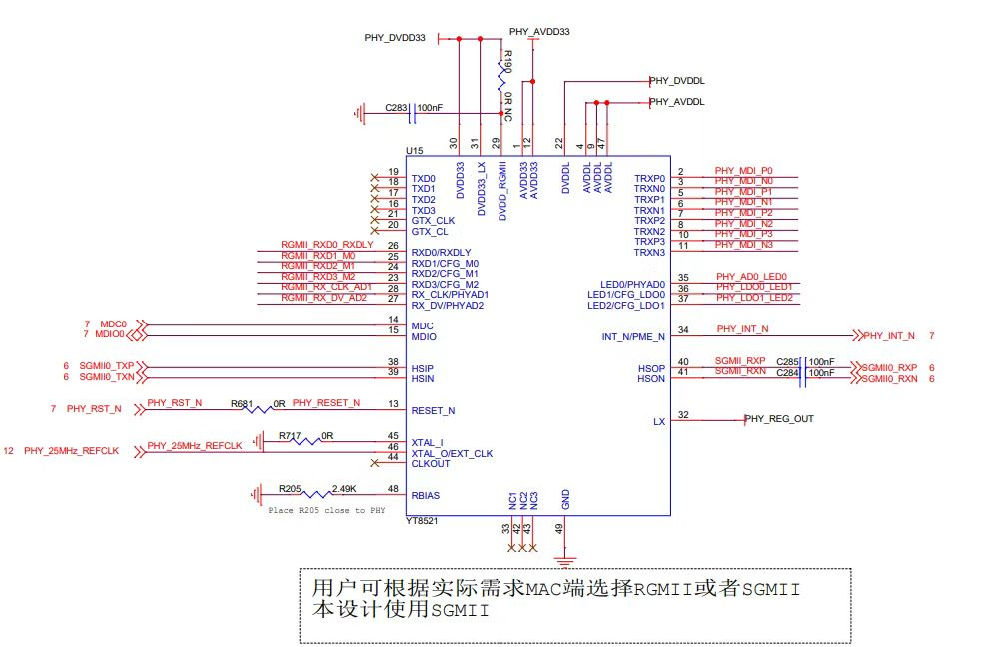

# FXMAC ethernet driver
fxmac ethernet driver in Rust on PhytiumPi board.

## Quick Start

* Initialize ethernet driver
```
pub struct FXmacDriver;

#[crate_interface::impl_interface]
impl axdriver_net::fxmac::KernelFunc for FXmacDriver{
	/// 虚拟地址转换成物理地址
	fn virt_to_phys(addr: usize) -> usize {
	}

	/// 物理地址转换成虚拟地址
	fn phys_to_virt(addr: usize) -> usize {
	}

	/// 申请页对齐的DMA连续内存页
	/// 返回((cpu virtual address, dma physical address))
	fn dma_alloc_coherent(pages: usize) -> (usize, usize) {
	}

	/// 释放DMA内存页
	fn dma_free_coherent(vaddr: usize, pages: usize) {
	}

	/// 使能并注册网卡中断
	fn dma_request_irq(_irq: usize, _handler: fn()) {
		warn!("unimplemented dma_request_irq for fxmax");
	}
}

let hwaddr: [u8; 6] = [0x55, 0x44, 0x33, 0x22, 0x11, 0x00];
let fxmac_device: &'static mut FXmac = fxmac_rs::fxmac::xmac_init(&hwaddr);
```

* Sending network packets
```
let mut tx_vec = Vec::new();
tx_vec.push(packet.to_vec());
FXmacLwipPortTx(fxmac_device, tx_vec);
```

* Receiving network packets
```
let recv_packets = FXmacRecvHandler(fxmac_device);

```

### Build

```
cargo build --target=aarch64-unknown-none-softfloat
```

## About ethernet
PHY: Motorcomm YT8521



## Reference
* [phytium-standalone-sdk](https://gitee.com/phytium_embedded/phytium-standalone-sdk/tree/master) *sdk驱动的代码质量及逻辑写得一言难尽啊 *
* [Linux 5.10](https://gitee.com/phytium_embedded/phytium-linux-kernel/blob/linux-5.10/drivers/net/ethernet/cadence/macb_main.c)
